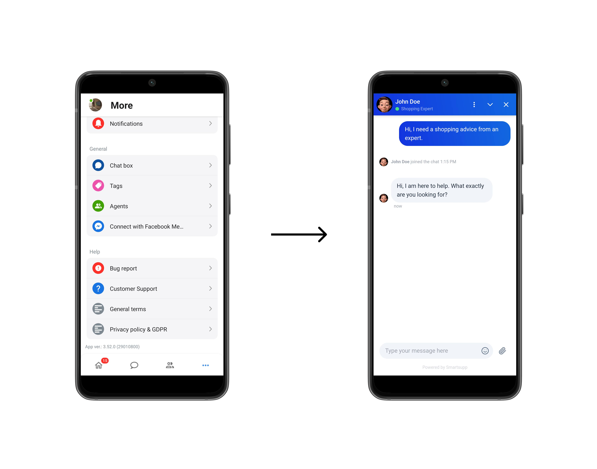

<picture>
  <source media="(prefers-color-scheme: dark)" srcset="./art/logo-dark.svg">
  
</picture>

# Add Smartsupp widget to your Android App

Welcome to the Smartsupp framework documentation, your getaway to integrating effortless live chat support into your mobile applications.
This document is designed to assist you in integrating and utilizing Smartsupp effectively within your projects.

## Features

- Full compatibility with the powerful Smartsupp widget
- Visitor identification through name, email, and telephone, with the option to add specific variables
- Information about the number of incoming messages and the status of your account

## Compatibility

Smartsupp for Android supports API 24 and above.

## Installation

Add the following dependency to your app's  `build.gradle`  file:

    dependencies {
        implementation("com.smartsupp.android:android-sdk:0.0.2")
    }

#### Maven central

Add the following to your root `build.gradle` file

    allprojects {
        repositories {
          mavenCentral()
        }
    }

## Documentation
For more information on how to use this SDK, visit the official [documentation](https://docs.smartsupp.com/mobile-sdk/).